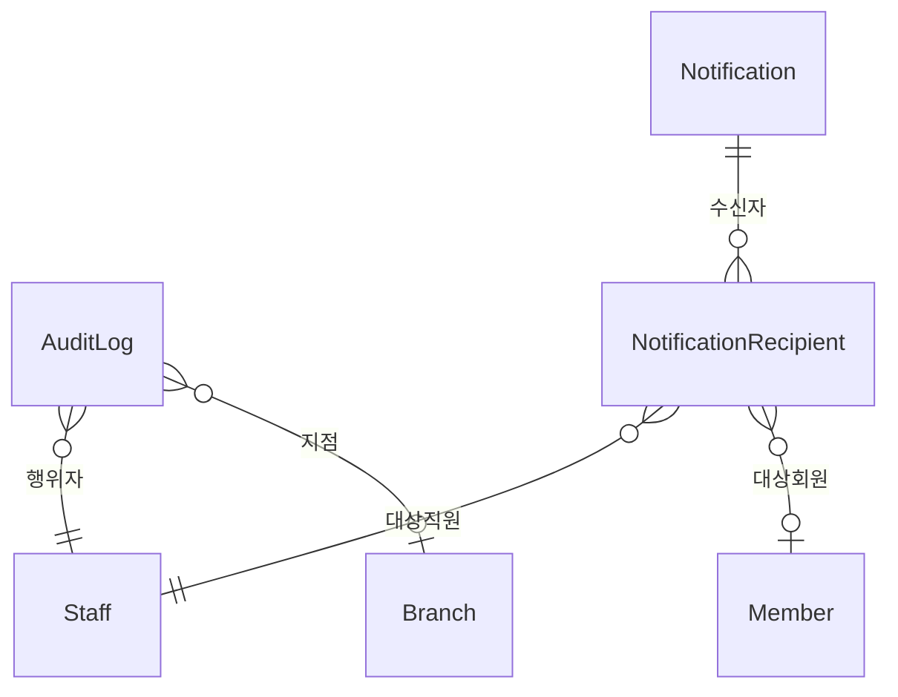
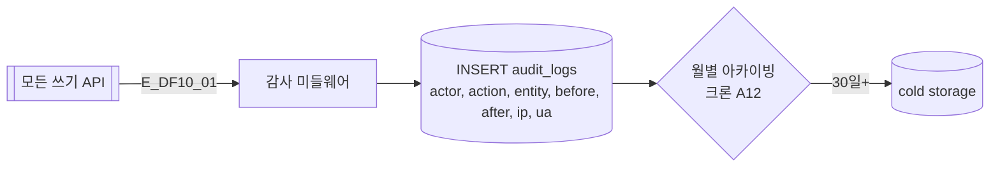
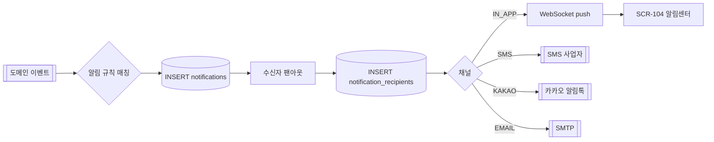
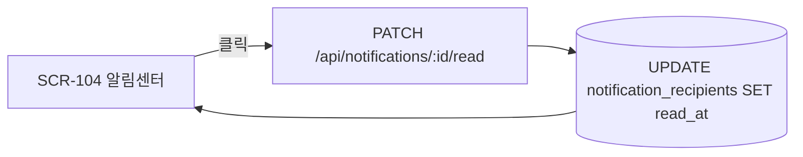

## 1. 엔티티 개요

모든 중요 이벤트는 감사로그(`AuditLog`)에 적재되며, 사용자 대상 알림(`Notification`)은 수신자(`NotificationRecipient`)별로 전파된다. S14 NotificationStatus 참조.

## 2. ER 다이어그램

## 3. 감사로그 적재 흐름

## 4. 알림 발송 흐름

## 5. 읽음 처리

## 6. 주요 필드

| 필드 | 비고 |
|------|------|
| audit_logs.action | CREATE/UPDATE/DELETE/LOGIN/EXPORT |
| audit_logs.entity | members/sales/... |
| audit_logs.diff | before/after JSON |
| notifications.channel | IN_APP/SMS/KAKAO/EMAIL |
| notification_recipients.status | S14 |

## 7. 인덱스/제약

- `INDEX(audit_logs.actor_staff_id, created_at DESC)`
- `INDEX(audit_logs.entity, entity_id, created_at)`
- `INDEX(notification_recipients.staff_id, status, created_at)`
- 감사로그는 append-only (수정/삭제 불가)

## 8. TC 후보

| TC ID | 타입 | 설명 |
|-------|:----:|------|
| TC-DF10-01 | positive | 중요 쓰기 API 실행 시 감사로그 자동 적재 |
| TC-DF10-02 | positive | 알림 생성 → 다채널 팬아웃 |
| TC-DF10-03-NEG | negative | 감사로그 수정 시도 시 거부 |
| TC-DF10-04 | boundary | 알림 수 1만건 초과 시 페이지네이션 |
