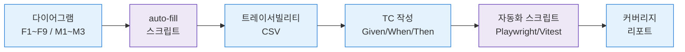

# QA 팀 TC 작성 핸드오프 가이드

> **대상**: QA 엔지니어, 테스트 자동화 담당자
> **목적**: 다이어그램 → TC 변환 작업의 일관된 수행
> **기준**: `../INDEX.md` + `TC_트레이서빌리티_매트릭스.csv`

---

## 1. 워크플로우 개요



---

## 2. 다이어그램 → TC 변환 규칙

### 2.1 엣지 1개 = TC 1개 기본 원칙

| 다이어그램 요소 | TC 필드 |
|-----------------|---------|
| 출발 노드(예: SCR_M001, STATE_ACTIVE) | **Given** (전제상태) |
| 엣지 라벨(예: "저장 클릭 [중복 감지]") | **When** (행위 + 조건) |
| 도착 노드(예: DLG_M006, TOAST_OK) | **Then** (기대결과) |
| 엣지 ID(예: E_SCR_M002_DLG_M006_01) | **TC.traceId** (역추적) |

### 2.2 TC 타입별 수량 가이드

| F 다이어그램 | 엣지 수 | 권장 TC 수 |
|--------------|:----:|:----:|
| F2 메인 (Happy Path) | 10~15 | 2~3 positive |
| F6 상태별 (빈/에러) | 5~8 | 1~2 boundary |
| F7 권한 (6역할) | 6~12 | 6 negative (역할당 1) |
| F8 에러 | 8~15 | 5~8 exception |

### 2.3 TC ID 규칙

```
TC-{도메인ID}-{일련번호}[-접미사]
예:
  TC-M002-001        positive
  TC-M002-005-NEG    negative
  TC-M002-010-EXC    exception
  TC-M002-012-BND    boundary
```

---

## 3. TC 작성 템플릿

### 3.1 표준 TC 포맷

```yaml
id: TC-M002-005-NEG
title: 회원 등록 시 연락처 중복 감지
traceId: E_SCR_M002_DLG_M006_01
diagramId: F2_SCR-M002
priority: P0
type: negative
automated: Y

given:
  - 매니저 로그인
  - 동일 지점 내 연락처 010-1111-2222로 이미 등록된 회원 존재
  - 회원 목록 화면 진입

when:
  - 회원 추가 버튼 클릭
  - 필수필드 입력 (이름, 연락처=010-1111-2222, 성별, 생년월일)
  - 저장 버튼 클릭

then:
  - DLG-M006 중복 확인 모달 표시
  - 기존 회원 정보 프리뷰 노출
  - [기존 회원 선택] / [계속 신규] 버튼 표시

testData:
  existingPhone: "010-1111-2222"
  newName: "김신규"

expectedApi:
  endpoint: POST /api/members
  status: 409
  body: {error: "PHONE_DUPLICATE", existingMemberId: "..."}
```

### 3.2 Playwright 자동화 스켈레톤

```typescript
import { test, expect } from '@playwright/test';

// traceId = E_SCR_M002_DLG_M006_01
test('TC-M002-005-NEG 연락처 중복 감지', async ({ page }) => {
  await loginAs(page, 'manager');
  await page.goto('/members');
  await page.getByRole('button', { name: '회원 추가' }).click();
  await page.getByLabel('이름').fill('김신규');
  await page.getByLabel('연락처').fill('010-1111-2222');
  await page.getByLabel('성별').selectOption('M');
  await page.getByLabel('생년월일').fill('2000-01-01');

  const [response] = await Promise.all([
    page.waitForResponse(r => r.url().includes('/api/members') && r.request().method() === 'POST'),
    page.getByRole('button', { name: '저장' }).click(),
  ]);

  expect(response.status()).toBe(409);
  await expect(page.getByTestId('dlg-m006')).toBeVisible();
  await expect(page.getByText('이미 등록된 연락처')).toBeVisible();
});
```

---

## 4. CSV 활용법

### 4.1 필터링 예시

```bash
# P0 네거티브 엣지만 추출
grep -E ',(negative|exception),P0,' TC_트레이서빌리티_매트릭스.csv

# 특정 SCR의 전체 엣지
grep 'SCR_M002' TC_트레이서빌리티_매트릭스.csv

# 자동화 가능(automated=Y) P0/P1만
awk -F',' '$9 ~ /P0|P1/ && $10=="Y"' TC_트레이서빌리티_매트릭스.csv
```

### 4.2 TC ID 수정 워크플로우

1. 플레이스홀더 `TC-M002-001` → 실제 `TC-MEM-005-NEG`로 교체
2. `notes` 컬럼에 작성 상태 기록 (`draft`, `review`, `done`)
3. `automated` 컬럼 실사 업데이트 (`Y`/`N`/`PARTIAL`)
4. 커버리지 스크립트 재실행

---

## 5. 우선순위 적용 기준

### 5.1 P0 (Blocker)
- 핵심 수익 흐름: 회원 등록, POS 결제, 이용권 개시
- 보안/권한: 로그인, 2FA, RBAC 분기
- 데이터 무결성: 결제 트랜잭션, 감사로그

### 5.2 P1 (Major)
- 일상 운영: 회원 수정, 상담, 메시지 발송, 수업 등록
- 자동화: 크론(A01~A12) 전체
- 주요 상태 전이: 홀딩, 만료, 탈퇴

### 5.3 P2 (Minor)
- 보조 기능: 엑셀 다운로드, 필터/정렬, 통계 조회
- UI 상태: 빈/로딩/토스트

### 5.4 P3 (Trivial)
- 단축키, 스타일, 미구현 🆕

---

## 6. 커버리지 목표

| 지표 | 최소 | 목표 |
|------|:----:|:----:|
| 엣지 매핑 커버리지 | 90% | 95% |
| P0 TC 자동화율 | 80% | 100% |
| P1 TC 자동화율 | 60% | 80% |
| 네거티브 TC 비율 | 25% | 30%+ |
| RBAC 6역할 커버 | 100% | 100% |

---

## 7. 체크리스트

### TC 작성 전
- [ ] 대상 SCR의 F1~F9 모두 훑어보기
- [ ] 관련 DLG 3종 세트 확인
- [ ] 관련 상태전이도(S1~S16) 확인
- [ ] 관련 시퀀스(X01~X30) 확인
- [ ] CSV에서 해당 엣지 추출

### TC 작성 후
- [ ] traceId 기재
- [ ] Given/When/Then 완결성
- [ ] 테스트데이터 명시
- [ ] 예상 API 응답 코드/바디
- [ ] automated 여부 판정
- [ ] CSV notes에 상태 기록

### 배포 전
- [ ] verify-diagram-tc-mapping.cjs 통과 (≥95%)
- [ ] verify-scr-dlg-consistency.cjs 통과 (불일치 0건)
- [ ] diagram-coverage.cjs 통과 (SCR/DLG 각 100%)
- [ ] Playwright 스위트 그린 (P0/P1)

---

## 8. FAQ

**Q. 엣지 ID가 겹치면?**
A. 다이어그램 내에서 고유해야 함. 중복 시 `_nn` 일련번호로 구분.

**Q. 동일 기능을 여러 다이어그램에서 참조하면?**
A. edgeId는 다이어그램별로 다르지만, 같은 TC ID를 매핑 (1:N).

**Q. 🆕 미구현 기능 TC는?**
A. 작성하되 `automated=N`, `notes=NOT_IMPLEMENTED` 명시. 구현 시 자동화.

**Q. 상태전이(stateDiagram)의 TC는?**
A. 각 전이 이벤트(T-MEM-01 등)마다 1~2개 TC (정상/예외).

**Q. 시퀀스 다이어그램(X01~X30)의 TC는?**
A. E2E 시나리오 TC로 작성. 평균 3~5개 TC/시나리오.

---

## 9. 도구 레퍼런스

| 도구 | 용도 | 경로 |
|------|------|------|
| auto-fill-tc-matrix.cjs | 엣지 자동 추출 | `scripts/diagram/` |
| verify-diagram-tc-mapping.cjs | 커버리지 검증 | `scripts/diagram/` |
| verify-scr-dlg-consistency.cjs | 일관성 검증 | `scripts/diagram/` |
| diagram-coverage.cjs | 채움률 리포트 | `scripts/diagram/` |
| Playwright | E2E 자동화 | `e2e/` |
| /e2e generate | TC→E2E 생성 | skill |
| /generate-tc | TC 문서 생성 | skill |

---

## 10. 에스컬레이션

- 다이어그램 오류: 기획팀 → 화면설계서+다이어그램 동시 수정
- 엣지 누락: 기획팀에 이슈 보고
- TC 자동화 불가(GUI 제약): QA팀 수동 TC로 분류 + notes 기재
- 성능/부하 TC: 별도 K6/JMeter 스위트 (본 매트릭스에서 제외)
