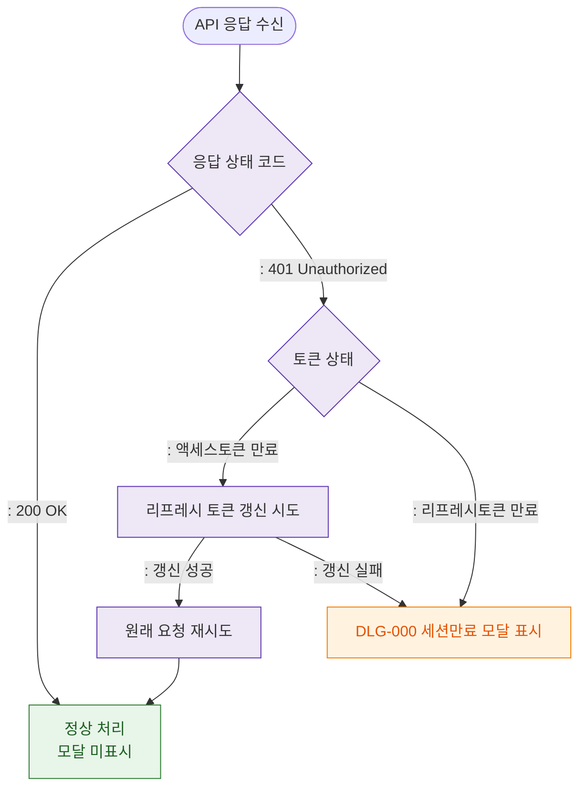

# M2 필드검증 플로우 — DLG-000 세션만료 모달

## 목적
세션만료 모달은 입력 필드가 없으므로 검증 대상이 없다. 대신 401 토큰 상태 검증 흐름을 정의한다.

## 다이어그램

## TC 후보

| TC ID | 타입 | Given | When | Then | |-------|------|-------|------|------| | TC-D000-M2-01 | positive | manager | 액세스토큰 만료 | 리프레시 갱신 시도 | | TC-D000-M2-02 | positive | manager | 리프레시 갱신 성공 | 원래 요청 재시도 | | TC-D000-M2-03 | negative | manager | 리프레시 갱신 실패 | DLG-000 모달 표시 | | TC-D000-M2-04 | negative | manager | 리프레시토큰 만료 | DLG-000 모달 표시 |
