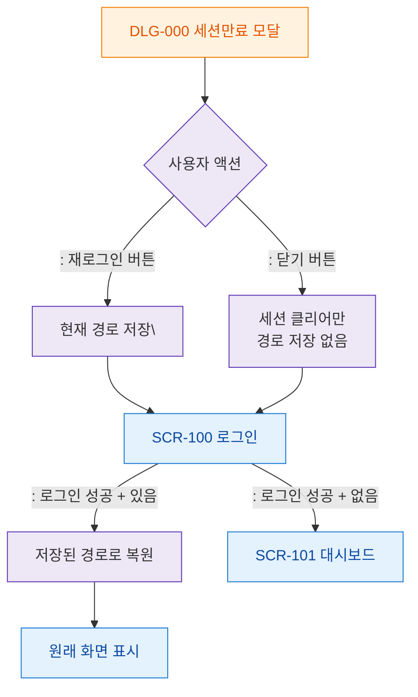

# M3 결과분기 플로우 — DLG-000 세션만료 모달

## 목적
세션만료 모달 액션 결과에 따른 분기(재로그인/닫기)와 로그인 후 원래 경로 복원을 정의한다.

## 다이어그램

## TC 후보

| TC ID | 타입 | Given | When | Then | |-------|------|-------|------|------| | TC-D000-M3-01 | positive | manager | 재로그인 클릭 | 현재 경로 저장 + SCR-100 | | TC-D000-M3-02 | positive | manager | 로그인 후 있음 | 원래 화면으로 복원 | | TC-D000-M3-03 | positive | manager | 로그인 후 없음 | 대시보드 이동 |
