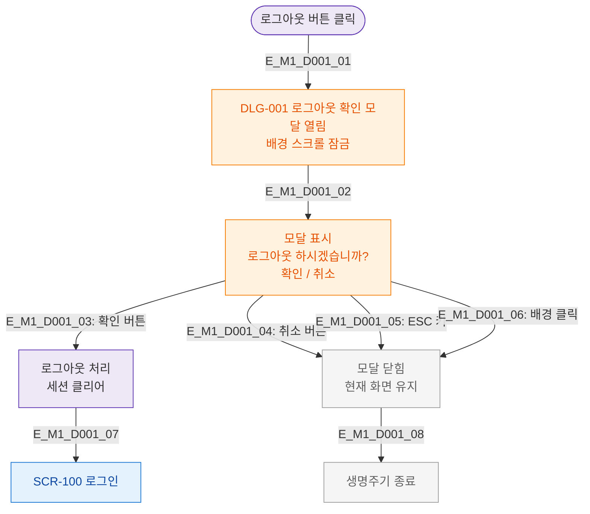

# M1 생명주기 플로우 — DLG-001 로그아웃 확인

## 목적
로그아웃 버튼 클릭 → 확인 모달 → 확인/취소 분기까지 생명주기를 정의한다.

## 다이어그램

## TC 후보

| TC ID | 타입 | Given | When | Then |
|-------|------|-------|------|------|
| TC-D001-M1-01 | positive | manager | 로그아웃 버튼 클릭 | DLG-001 모달 열림 |
| TC-D001-M1-02 | positive | manager | 확인 버튼 클릭 | 로그아웃 처리 + SCR-100 |
| TC-D001-M1-03 | positive | manager | 취소 버튼 클릭 | 모달 닫힘 + 현재 화면 유지 |
| TC-D001-M1-04 | positive | manager | ESC 키 입력 | 모달 닫힘 |
