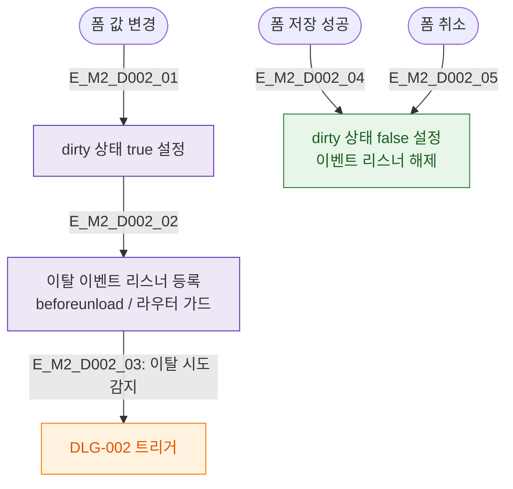

# M2 필드검증 플로우 — DLG-002 이탈 경고

## 목적
이탈 경고 모달은 입력 필드가 없으며, dirty state 감지 로직을 정의한다.

## 다이어그램

## TC 후보

| TC ID | 타입 | Given | When | Then |
|-------|------|-------|------|------|
| TC-D002-M2-01 | positive | manager | 폼 값 변경 | dirty 상태 true |
| TC-D002-M2-02 | positive | manager | 저장 성공 | dirty 상태 false |
| TC-D002-M2-03 | positive | manager | dirty true 상태에서 이탈 | DLG-002 트리거 |
