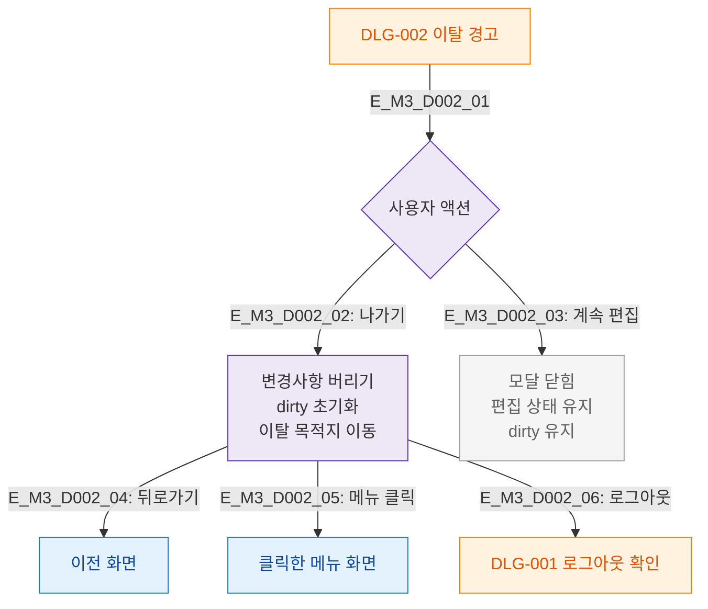

# M3 결과분기 플로우 — DLG-002 이탈 경고

## 목적
나가기/계속편집 결과에 따른 분기를 정의한다.

## 다이어그램

## TC 후보

| TC ID | 타입 | Given | When | Then |
|-------|------|-------|------|------|
| TC-D002-M3-01 | positive | manager | 나가기 | 변경사항 버리고 이전 화면 |
| TC-D002-M3-02 | positive | manager | 나가기 + 메뉴 클릭 | 해당 메뉴 화면 이동 |
| TC-D002-M3-03 | positive | manager | 계속 편집 | 편집 상태 유지 |
