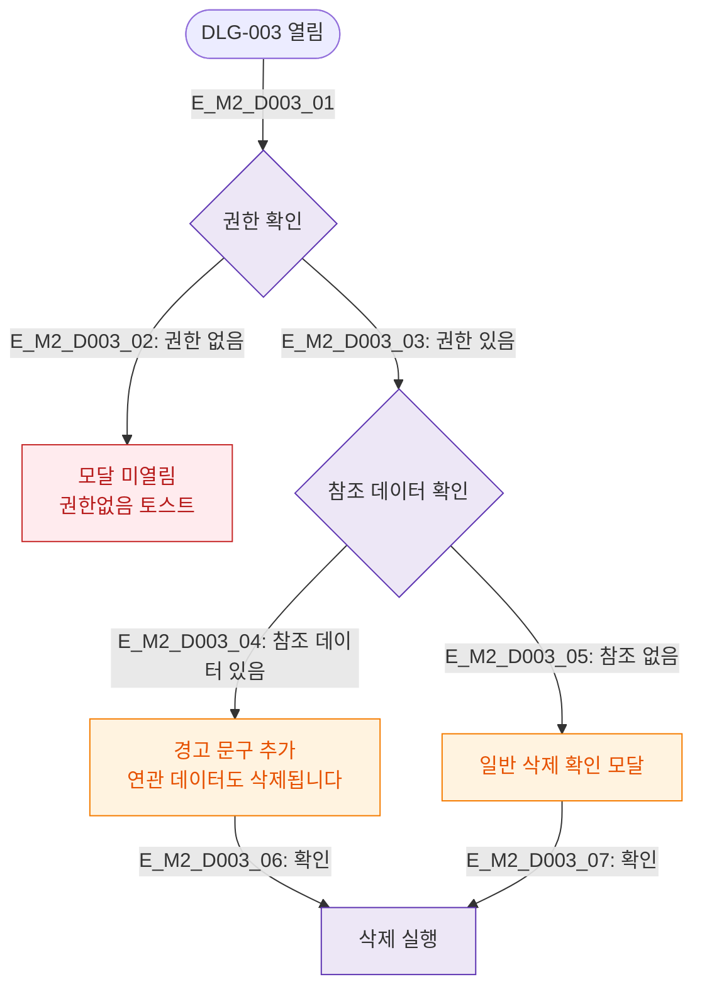

# M2 필드검증 플로우 — DLG-003 삭제 확인

## 목적
삭제 전 권한 검증과 삭제 가능 조건(참조 데이터 없음 등)을 정의한다.

## 다이어그램

## TC 후보

| TC ID | 타입 | Given | When | Then |
|-------|------|-------|------|------|
| TC-D003-M2-01 | negative | fc (권한 없음) | 삭제 버튼 클릭 | 권한없음 토스트 (모달 미열림) |
| TC-D003-M2-02 | exception | manager | 참조 데이터 있는 항목 삭제 | 경고 문구 포함 모달 |
| TC-D003-M2-03 | positive | manager | 참조 없는 항목 삭제 | 일반 삭제 확인 모달 |
