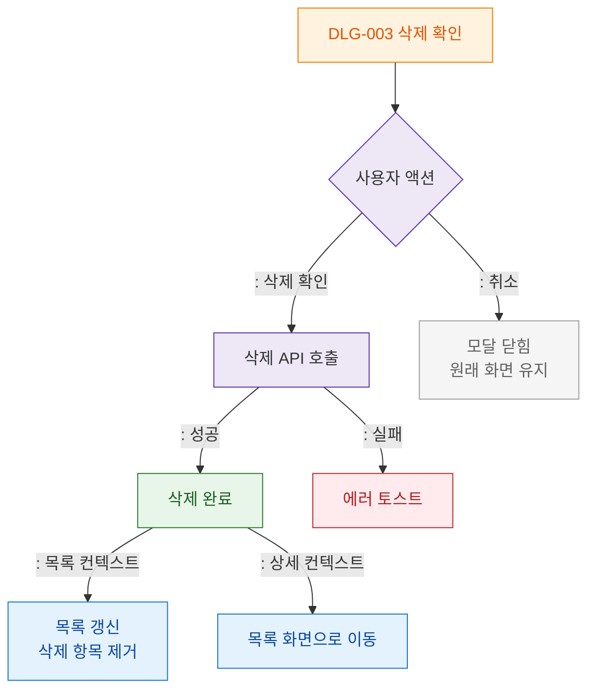

# M3 결과분기 플로우 — DLG-003 삭제 확인

## 목적
삭제 확인/취소 결과 분기와 삭제 후 화면 처리를 정의한다.

## 다이어그램

## TC 후보

| TC ID | 타입 | Given | When | Then | |-------|------|-------|------|------| | TC-D003-M3-01 | positive | manager (목록) | 삭제 성공 | 목록 갱신 + 항목 제거 | | TC-D003-M3-02 | positive | manager (상세) | 삭제 성공 | 목록 화면 이동 | | TC-D003-M3-03 | negative | manager | 삭제 API 실패 | 에러 토스트 | | TC-D003-M3-04 | positive | manager | 취소 | 원래 화면 유지 |
