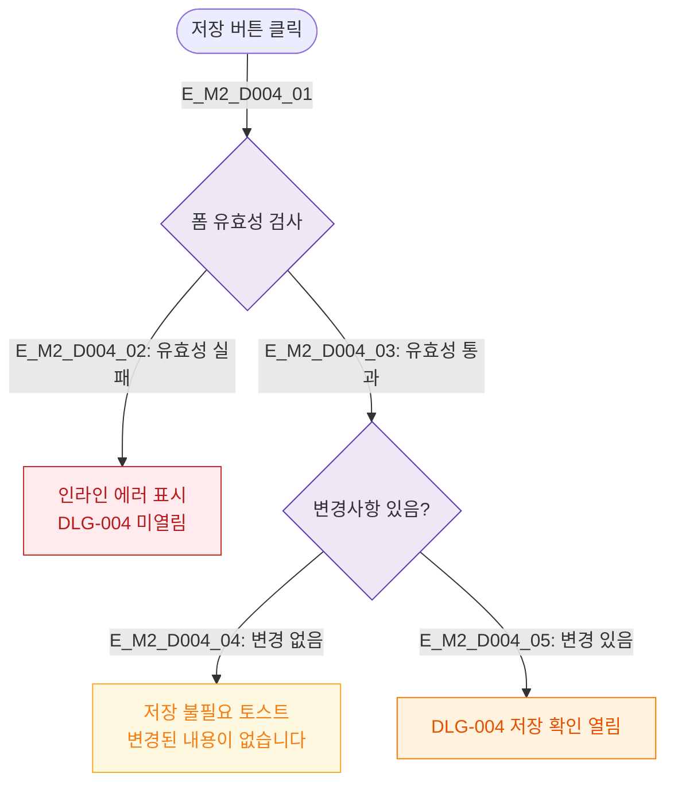

# M2 필드검증 플로우 — DLG-004 저장 확인

## 목적
저장 확인 모달 열기 전 필수 필드 검증과 저장 가능 조건을 정의한다.

## 다이어그램

## TC 후보

| TC ID | 타입 | Given | When | Then |
|-------|------|-------|------|------|
| TC-D004-M2-01 | negative | manager | 필수 필드 미입력 저장 | 인라인 에러 (모달 미열림) |
| TC-D004-M2-02 | exception | manager | 변경 없이 저장 클릭 | 변경 없음 토스트 |
| TC-D004-M2-03 | positive | manager | 유효 + 변경 있음 | DLG-004 열림 |
