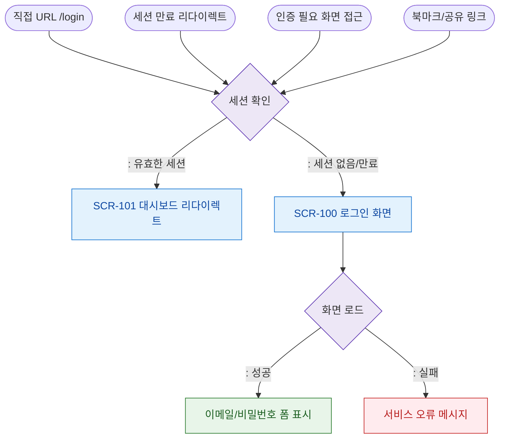

# F1 진입 플로우 — SCR-100 로그인

## 다이어그램

## TC 후보
| TC ID | 타입 | Given | When | Then | |-------|------|-------|------|------| | TC-100-F1-01 | positive | 유효 세션 | /login 접근 | 대시보드 리다이렉트 | | TC-100-F1-02 | positive | 세션 없음 | /login 접근 | 로그인 폼 표시 | | TC-100-F1-03 | positive | 세션 만료 | 보호된 화면 접근 | 로그인 리다이렉트 |
