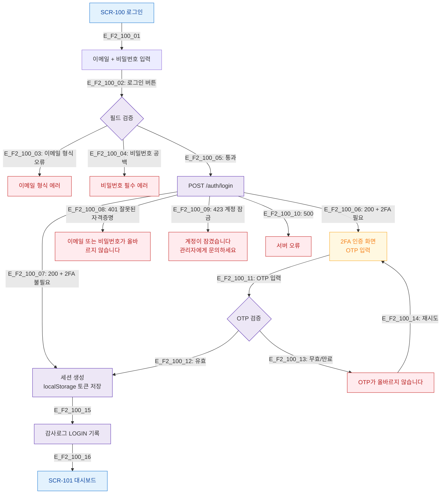

# F2 메인 인터랙션 플로우 — SCR-100 로그인

## 목적
로그인 정상 흐름: 이메일/비밀번호 입력 → 2FA → 세션 생성 → 대시보드 (X29 시퀀스 참조)

## 다이어그램

## TC 후보
| TC ID | 타입 | Given | When | Then |
|-------|------|-------|------|------|
| TC-100-F2-01 | positive | 유효 계정 | 이메일+비밀번호 입력 후 로그인 | 세션 생성, 대시보드 이동 |
| TC-100-F2-02 | positive | 2FA 활성 계정 | 로그인 | OTP 입력 화면 표시 |
| TC-100-F2-03 | negative | 잘못된 자격증명 | 로그인 시도 | 401 에러 메시지 |
| TC-100-F2-04 | negative | 잠긴 계정 | 로그인 시도 | 423 계정 잠금 메시지 |
| TC-100-F2-05 | negative | 2FA 활성 | 잘못된 OTP 입력 | OTP 오류 메시지 |
