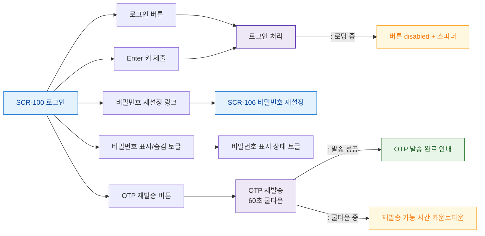

# F3 버튼/액션 매핑 — SCR-100 로그인

## 다이어그램

## TC 후보
| TC ID | 타입 | Given | When | Then | |-------|------|-------|------|------| | TC-100-F3-01 | positive | 로그인 폼 | Enter 키 | 로그인 처리 실행 | | TC-100-F3-02 | positive | OTP 화면 | OTP 재발송 버튼 | OTP 발송, 60초 쿨다운 | | TC-100-F3-03 | positive | 비밀번호 입력 | 표시/숨김 토글 | 비밀번호 가시성 토글 |
