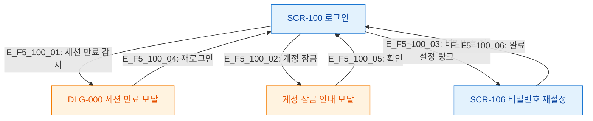

# F5 모달 트리거 트리 — SCR-100 로그인

## 다이어그램

## TC 후보
| TC ID | 타입 | Given | When | Then |
|-------|------|-------|------|------|
| TC-100-F5-01 | positive | 세션 만료 | 로그인 화면 진입 | DLG-000 세션 만료 모달 표시 |
| TC-100-F5-02 | negative | 계정 잠금 | 로그인 시도 | 계정 잠금 안내 모달 |
