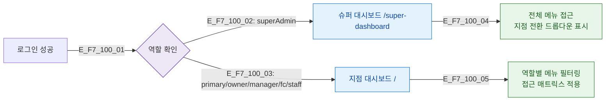

# F7 권한(RBAC) 분기 — SCR-100 로그인

## 다이어그램

## TC 후보
| TC ID | 타입 | Given | When | Then |
|-------|------|-------|------|------|
| TC-100-F7-01 | positive | superAdmin 로그인 | 로그인 성공 | 슈퍼 대시보드 이동 |
| TC-100-F7-02 | positive | manager 로그인 | 로그인 성공 | 지점 대시보드 이동, 역할별 메뉴 |
