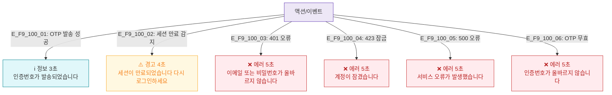

# F9 토스트/피드백 플로우 — SCR-100 로그인

## 다이어그램

## TC 후보
| TC ID | 타입 | Given | When | Then |
|-------|------|-------|------|------|
| TC-100-F9-01 | positive | 2FA | OTP 발송 성공 | 정보 토스트 3초 |
| TC-100-F9-02 | negative | 세션 만료 | 리다이렉트 | 경고 토스트 4초 |
| TC-100-F9-03 | negative | 잘못된 자격증명 | 로그인 | 에러 토스트 5초 |
