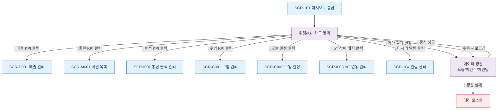

# F2 메인 인터랙션 플로우 — SCR-101 대시보드 통합

## 목적
대시보드 위젯/KPI 카드 클릭 시 해당 도메인 화면으로 이동하는 인터랙션과 데이터 갱신 흐름을 정의한다.

## 다이어그램

## TC 후보

| TC ID | 타입 | Given | When | Then | |-------|------|-------|------|------| | TC-101-F2-01 | positive | manager | 매출 KPI 카드 클릭 | SCR-D001 이동 | | TC-101-F2-02 | positive | manager | 출석 KPI 카드 클릭 | SCR-I001 이동 | | TC-101-F2-03 | positive | manager | 기간 필터 '이번달' 선택 | 데이터 갱신 | | TC-101-F2-04 | negative | manager | 데이터 갱신 실패 | 에러 토스트 표시 | | TC-101-F2-05 | positive | staff | IoT 장애 배지 클릭 | SCR-I003 이동 |
