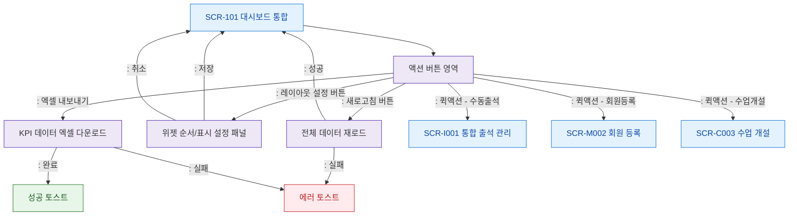

# F3 버튼/액션 플로우 — SCR-101 대시보드 통합

## 목적
대시보드 상단 액션 버튼(새로고침, 레이아웃 설정, 내보내기)과 퀵액션 버튼의 동작을 정의한다.

## 다이어그램

## TC 후보

| TC ID | 타입 | Given | When | Then | |-------|------|-------|------|------| | TC-101-F3-01 | positive | manager | 새로고침 버튼 클릭 | 전체 데이터 재로드 | | TC-101-F3-02 | positive | manager | 엑셀 내보내기 클릭 | KPI 엑셀 다운로드 완료 | | TC-101-F3-03 | positive | manager | 퀵액션 수동출석 클릭 | SCR-I001 이동 | | TC-101-F3-04 | negative | staff | 레이아웃 설정 저장 | 위젯 순서 변경 반영 | | TC-101-F3-05 | negative | manager | 엑셀 내보내기 실패 | 에러 토스트 표시 |
