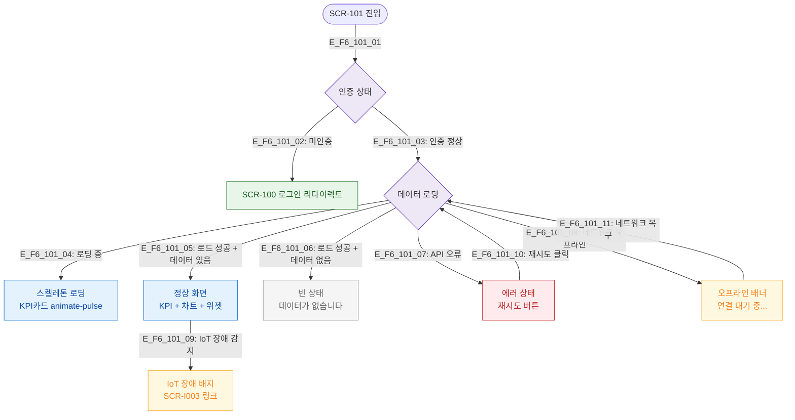

# F6 상태별 화면 플로우 — SCR-101 대시보드 통합

## 목적
로딩/빈/에러/오프라인 등 UI 상태별 분기를 정의한다.

## 다이어그램

## TC 후보

| TC ID | 타입 | Given | When | Then |
|-------|------|-------|------|------|
| TC-101-F6-01 | positive | manager | 대시보드 진입 중 | 스켈레톤 로딩 표시 |
| TC-101-F6-02 | positive | manager, 데이터 없음 | 로드 완료 | 빈 상태 메시지 표시 |
| TC-101-F6-03 | negative | manager | API 서버 오류 | 에러 상태 + 재시도 버튼 |
| TC-101-F6-04 | negative | manager | 네트워크 오프라인 | 오프라인 배너 표시 |
| TC-101-F6-05 | negative | manager | IoT 장애 감지 | IoT 장애 배지 + 링크 표시 |
