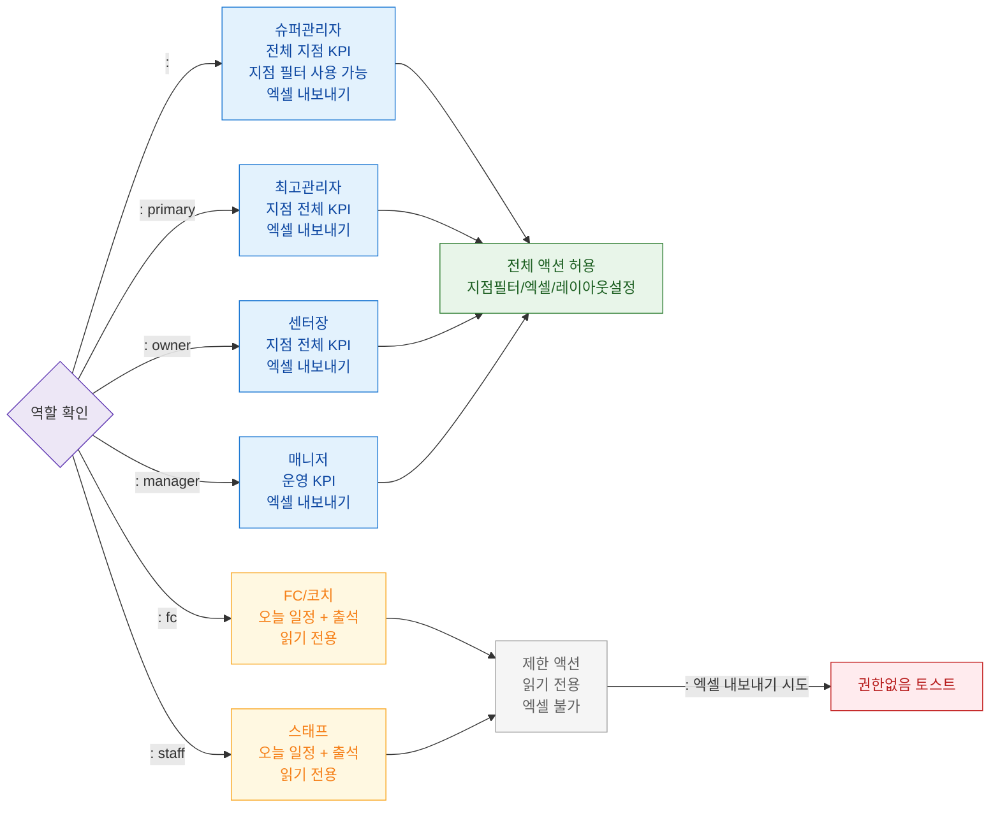

# F7 권한(RBAC) 분기 플로우 — SCR-101 대시보드 통합

## 목적
6개 역할별 대시보드 위젯 표시 범위와 액션 가능 범위를 정의한다.

## 다이어그램

## TC 후보

| TC ID | 타입 | Given | When | Then | |-------|------|-------|------|------| | TC-101-F7-01 | positive | | 대시보드 진입 | 지점 필터 + 전체 지점 KPI 표시 | | TC-101-F7-02 | positive | manager | 대시보드 진입 | 운영 KPI + 엑셀 버튼 표시 | | TC-101-F7-03 | positive | staff | 대시보드 진입 | 오늘 일정/출석 위젯만 표시 | | TC-101-F7-04 | negative | fc | 엑셀 내보내기 버튼 클릭 | 권한없음 토스트 표시 |
