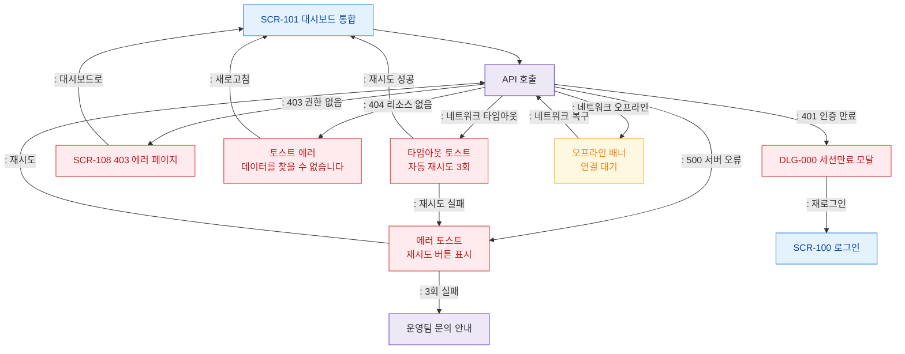

# F8 에러/예외/복구 플로우 — SCR-101 대시보드 통합

## 목적
에러코드별 분기, 재시도/로그아웃/리다이렉트 복구 경로를 정의한다.

## 다이어그램

## TC 후보

| TC ID | 타입 | Given | When | Then | |-------|------|-------|------|------| | TC-101-F8-01 | negative | manager | 세션 만료 상태에서 API 호출 | DLG-000 세션만료 모달 표시 | | TC-101-F8-02 | negative | manager | 서버 500 오류 | 에러 토스트 + 재시도 버튼 | | TC-101-F8-03 | negative | manager | 네트워크 타임아웃 | 자동 재시도 3회 후 에러 토스트 | | TC-101-F8-04 | negative | manager | 오프라인 상태 | 오프라인 배너 표시 |
