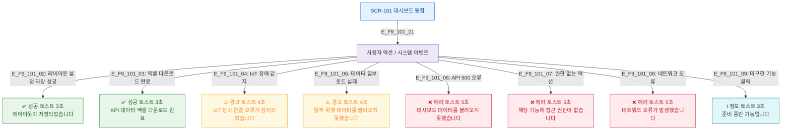

# F9 토스트/피드백 플로우 — SCR-101 대시보드 통합

## 목적
성공/경고/에러/정보 토스트 발생 조건과 메시지를 정의한다.

## 다이어그램

## TC 후보

| TC ID | 타입 | Given | When | Then |
|-------|------|-------|------|------|
| TC-101-F9-01 | positive | manager | 레이아웃 저장 성공 | 성공 토스트 3초 표시 |
| TC-101-F9-02 | positive | manager | 엑셀 다운로드 완료 | 완료 토스트 3초 표시 |
| TC-101-F9-03 | negative | manager | API 500 오류 | 에러 토스트 5초 표시 |
| TC-101-F9-04 | negative | fc | 엑셀 버튼 클릭 | 권한없음 에러 토스트 |
| TC-101-F9-05 | negative | manager | IoT 장애 감지 | 경고 토스트 4초 표시 |
