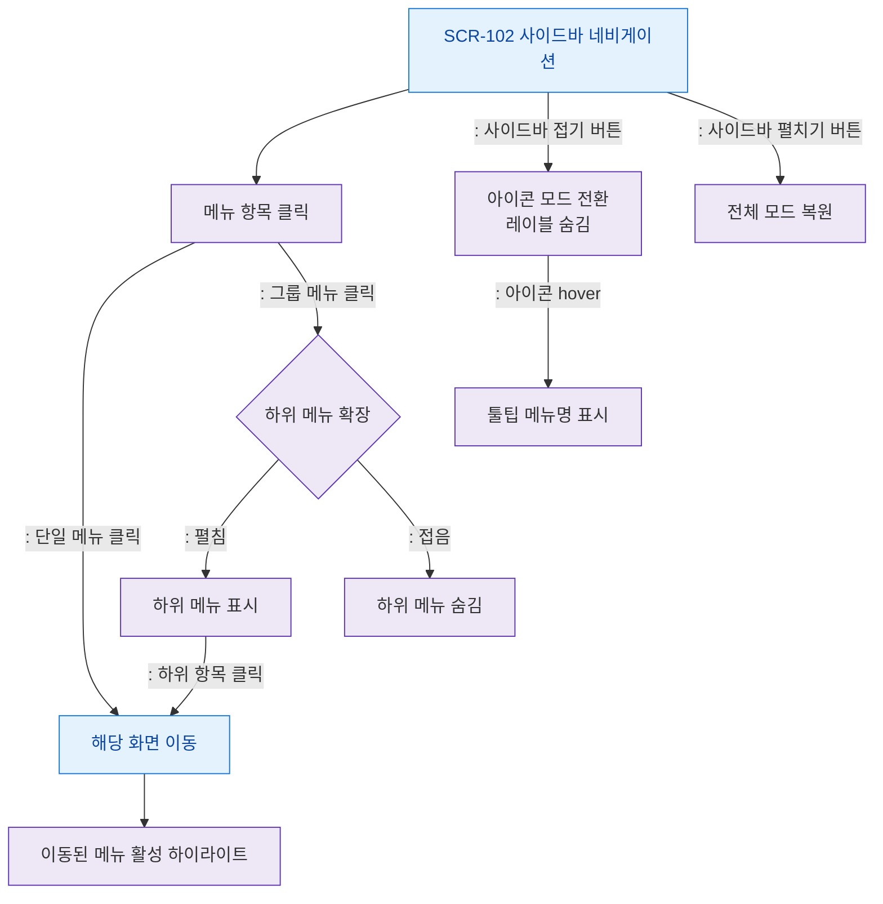

# F2 메인 인터랙션 플로우 — SCR-102 사이드바 네비게이션

## 목적
사이드바 메뉴 클릭, 접기/펼치기, 하위 메뉴 확장 등의 인터랙션을 정의한다.

## 다이어그램

## TC 후보

| TC ID | 타입 | Given | When | Then | |-------|------|-------|------|------| | TC-102-F2-01 | positive | manager | 단일 메뉴 클릭 | 해당 화면 이동 | | TC-102-F2-02 | positive | manager | 그룹 메뉴 클릭 | 하위 메뉴 펼침 | | TC-102-F2-03 | positive | manager | 사이드바 접기 버튼 | 아이콘 모드 전환 | | TC-102-F2-04 | positive | manager | 아이콘 모드 hover | 툴팁 표시 | | TC-102-F2-05 | positive | manager | 화면 이동 후 | 해당 메뉴 활성 하이라이트 |
