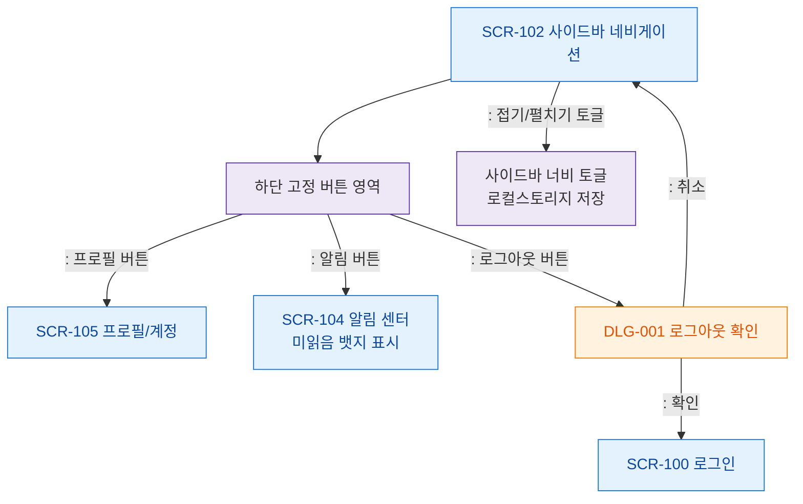

# F3 버튼/액션 플로우 — SCR-102 사이드바 네비게이션

## 목적
사이드바 하단 고정 버튼(프로필, 알림, 로그아웃)과 상단 접기/펼치기 버튼 동작을 정의한다.

## 다이어그램

## TC 후보

| TC ID | 타입 | Given | When | Then | |-------|------|-------|------|------| | TC-102-F3-01 | positive | manager | 프로필 버튼 클릭 | SCR-105 이동 | | TC-102-F3-02 | positive | manager | 알림 버튼 클릭 | SCR-104 이동 | | TC-102-F3-03 | positive | manager | 로그아웃 버튼 클릭 | DLG-001 로그아웃 확인 모달 표시 | | TC-102-F3-04 | positive | manager | 로그아웃 확인 | SCR-100 이동 | | TC-102-F3-05 | positive | manager | 사이드바 접기 토글 | 로컬스토리지에 상태 저장 |
