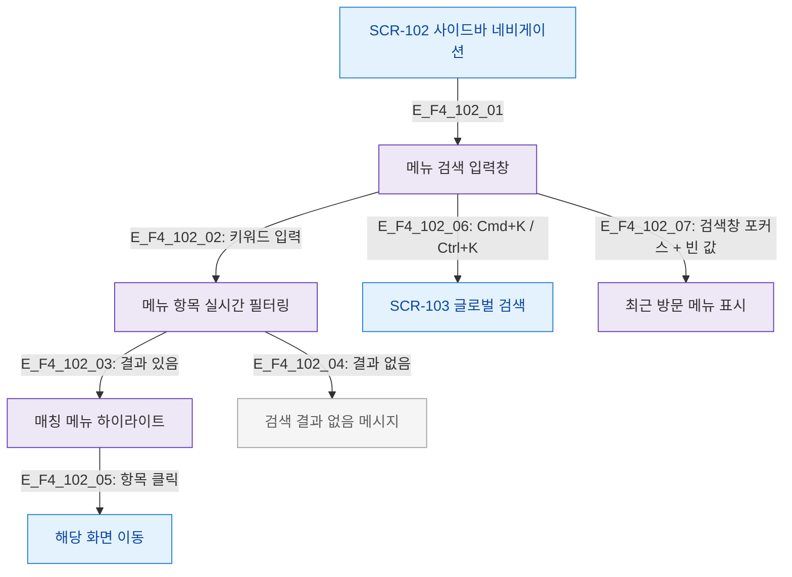

# F4 필터/검색 플로우 — SCR-102 사이드바 네비게이션

## 목적
사이드바 내 메뉴 검색 입력 및 글로벌 검색 연결 흐름을 정의한다.

## 다이어그램

## TC 후보

| TC ID | 타입 | Given | When | Then |
|-------|------|-------|------|------|
| TC-102-F4-01 | positive | manager | 메뉴 검색창 키워드 입력 | 매칭 메뉴 실시간 필터링 |
| TC-102-F4-02 | positive | manager | 검색 결과 항목 클릭 | 해당 화면 이동 |
| TC-102-F4-03 | negative | manager | 검색 결과 없음 | 결과 없음 메시지 표시 |
| TC-102-F4-04 | positive | manager | Cmd+K 입력 | SCR-103 글로벌 검색 열림 |
