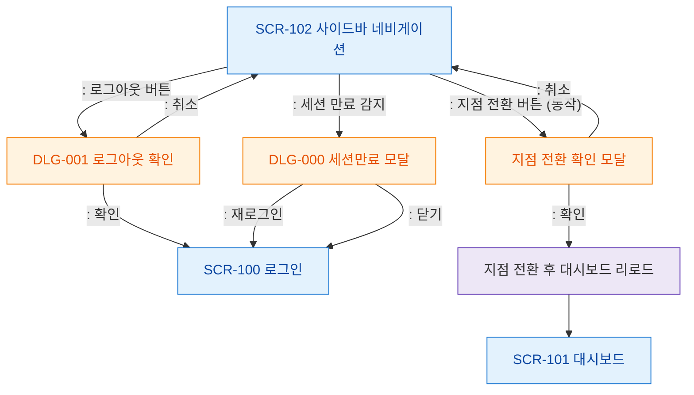

# F5 모달 트리거 트리 — SCR-102 사이드바 네비게이션

## 목적
사이드바에서 발생하는 모달/다이얼로그 트리거 경로를 정의한다.

## 다이어그램

## TC 후보

| TC ID | 타입 | Given | When | Then | |-------|------|-------|------|------| | TC-102-F5-01 | positive | manager | 로그아웃 버튼 클릭 | DLG-001 로그아웃 확인 열림 | | TC-102-F5-02 | negative | manager | 세션 만료 감지 | DLG-000 세션만료 모달 표시 | | TC-102-F5-03 | positive | | 지점 전환 버튼 클릭 | 지점 전환 확인 모달 표시 | | TC-102-F5-04 | positive | | 지점 전환 확인 | 대시보드 리로드 |
