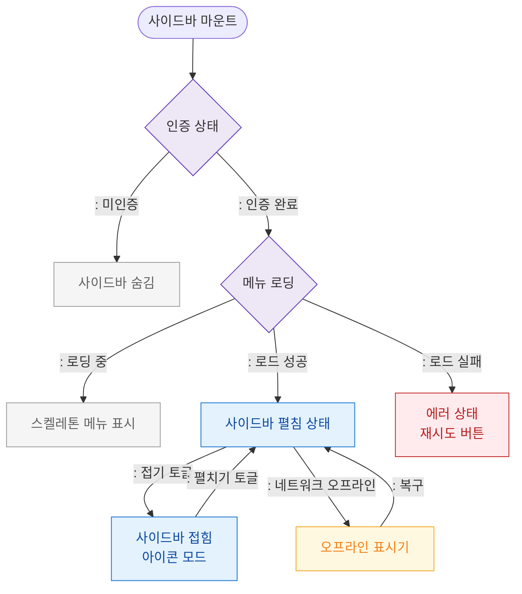

# F6 상태별 화면 플로우 — SCR-102 사이드바 네비게이션

## 목적
사이드바 로딩/접힘/펼침/오프라인/권한없음 등 상태별 UI 분기를 정의한다.

## 다이어그램

## TC 후보

| TC ID | 타입 | Given | When | Then | |-------|------|-------|------|------| | TC-102-F6-01 | positive | manager | 앱 진입 | 사이드바 펼침 상태 표시 | | TC-102-F6-02 | positive | manager | 접기 토글 | 아이콘 모드 전환 | | TC-102-F6-03 | negative | (미인증) | 앱 진입 | 사이드바 미표시 | | TC-102-F6-04 | negative | manager | 메뉴 로드 실패 | 에러 상태 + 재시도 버튼 | | TC-102-F6-05 | negative | manager | 네트워크 오프라인 | 오프라인 표시기 노출 |
