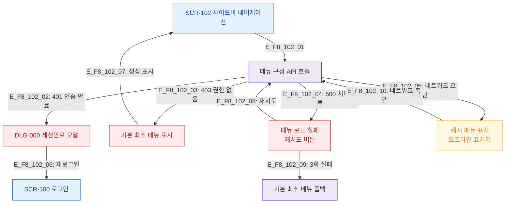

# F8 에러/예외/복구 플로우 — SCR-102 사이드바 네비게이션

## 목적
메뉴 로드 실패, 인증 만료, 네비게이션 오류 등의 복구 경로를 정의한다.

## 다이어그램

## TC 후보

| TC ID | 타입 | Given | When | Then |
|-------|------|-------|------|------|
| TC-102-F8-01 | negative | manager | 세션 만료 상태 | DLG-000 세션만료 모달 표시 |
| TC-102-F8-02 | negative | manager | 메뉴 API 500 오류 | 재시도 버튼 표시 |
| TC-102-F8-03 | negative | manager | 오프라인 상태 | 캐시 메뉴 + 오프라인 표시기 |
| TC-102-F8-04 | negative | manager | 재시도 3회 실패 | 기본 최소 메뉴 폴백 표시 |
