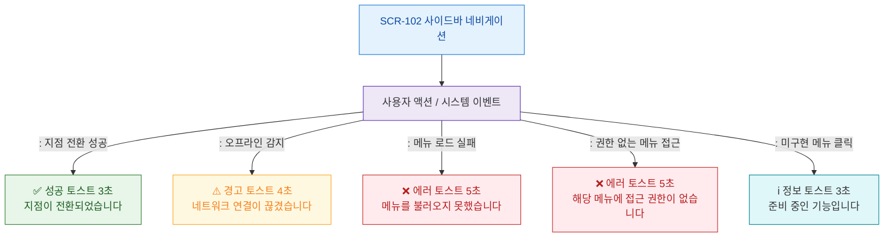

# F9 토스트/피드백 플로우 — SCR-102 사이드바 네비게이션

## 목적
사이드바 관련 성공/경고/에러/정보 토스트 발생 조건과 메시지를 정의한다.

## 다이어그램

## TC 후보

| TC ID | 타입 | Given | When | Then | |-------|------|-------|------|------| | TC-102-F9-01 | positive | | 지점 전환 성공 | 성공 토스트 3초 표시 | | TC-102-F9-02 | negative | manager | 메뉴 로드 실패 | 에러 토스트 5초 표시 | | TC-102-F9-03 | negative | fc | 비허용 메뉴 접근 | 권한없음 에러 토스트 | | TC-102-F9-04 | negative | manager | 오프라인 감지 | 경고 토스트 4초 표시 |
