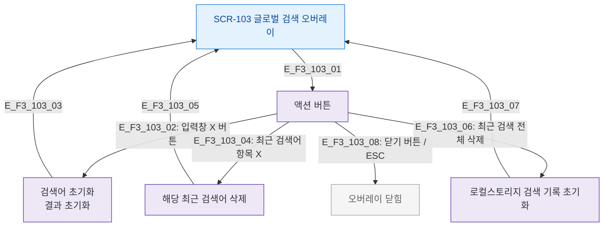

# F3 버튼/액션 플로우 — SCR-103 글로벌 검색

## 목적
검색 오버레이 내 버튼(지우기, 최근 검색 삭제, 닫기) 동작을 정의한다.

## 다이어그램

## TC 후보

| TC ID | 타입 | Given | When | Then |
|-------|------|-------|------|------|
| TC-103-F3-01 | positive | manager | 입력창 X 클릭 | 검색어 + 결과 초기화 |
| TC-103-F3-02 | positive | manager | 최근 검색어 X 클릭 | 해당 항목 삭제 |
| TC-103-F3-03 | positive | manager | 최근 검색 전체 삭제 | 기록 초기화 |
| TC-103-F3-04 | positive | manager | 닫기 버튼 | 오버레이 닫힘 |
