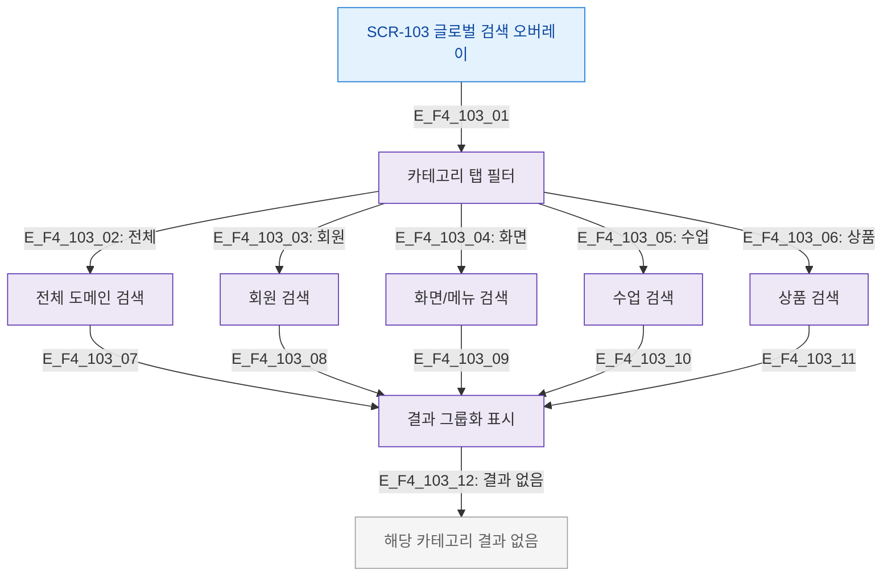

# F4 필터/검색 플로우 — SCR-103 글로벌 검색

## 목적
검색 결과 카테고리 필터(전체/회원/화면/수업/상품) 적용 흐름을 정의한다.

## 다이어그램

## TC 후보

| TC ID | 타입 | Given | When | Then |
|-------|------|-------|------|------|
| TC-103-F4-01 | positive | manager | '회원' 탭 클릭 | 회원 도메인 결과만 표시 |
| TC-103-F4-02 | positive | manager | '전체' 탭 클릭 | 전체 도메인 결과 표시 |
| TC-103-F4-03 | negative | manager | 해당 카테고리 결과 없음 | 카테고리 결과 없음 메시지 |
