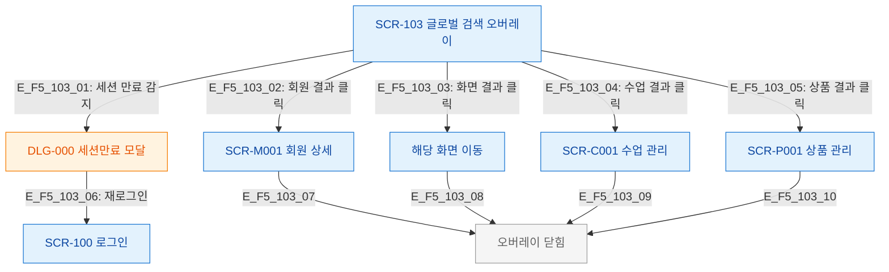

# F5 모달 트리거 트리 — SCR-103 글로벌 검색

## 목적
글로벌 검색 오버레이 자체가 모달 레이어이며, 내부에서 추가 모달이 열리는 경로를 정의한다.

## 다이어그램

## TC 후보

| TC ID | 타입 | Given | When | Then |
|-------|------|-------|------|------|
| TC-103-F5-01 | positive | manager | 회원 검색 결과 클릭 | 회원 상세 이동 + 오버레이 닫힘 |
| TC-103-F5-02 | positive | manager | 화면 검색 결과 클릭 | 해당 화면 이동 |
| TC-103-F5-03 | negative | manager | 세션 만료 감지 | DLG-000 세션만료 모달 표시 |
