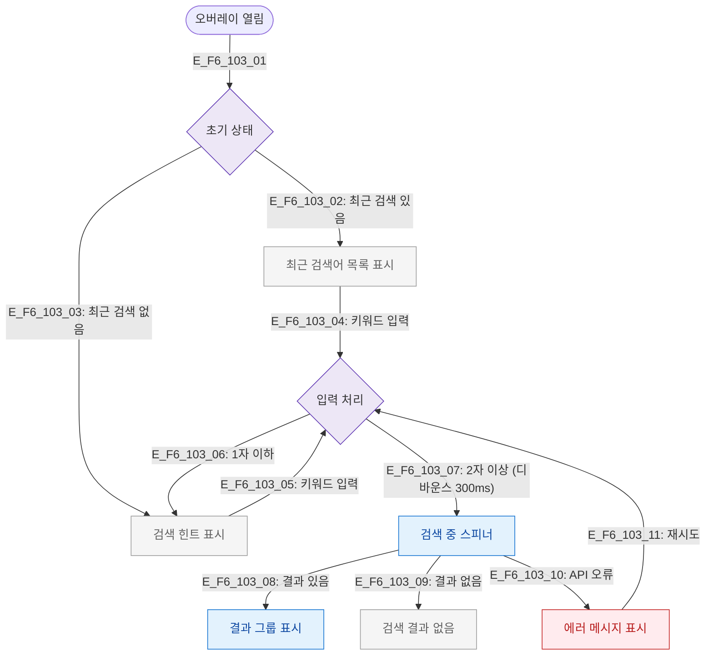

# F6 상태별 화면 플로우 — SCR-103 글로벌 검색

## 목적
검색 오버레이의 초기/입력중/로딩/결과있음/결과없음/에러 상태별 UI 분기를 정의한다.

## 다이어그램

## TC 후보

| TC ID | 타입 | Given | When | Then |
|-------|------|-------|------|------|
| TC-103-F6-01 | positive | manager (최근 검색 있음) | 오버레이 열림 | 최근 검색어 표시 |
| TC-103-F6-02 | positive | manager | 2자 입력 후 300ms | 검색 스피너 표시 |
| TC-103-F6-03 | positive | manager | 검색 결과 있음 | 결과 그룹 표시 |
| TC-103-F6-04 | negative | manager | 결과 없음 | 빈 상태 메시지 |
| TC-103-F6-05 | negative | manager | API 오류 | 에러 메시지 표시 |
