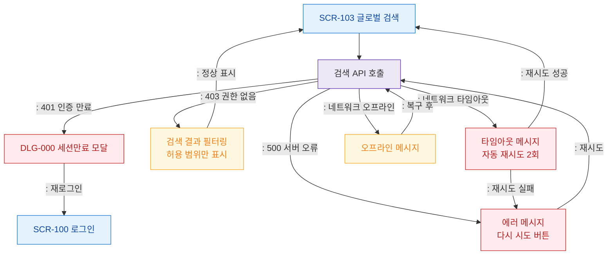

# F8 에러/예외/복구 플로우 — SCR-103 글로벌 검색

## 목적
검색 API 오류 분기와 복구 경로를 정의한다.

## 다이어그램

## TC 후보

| TC ID | 타입 | Given | When | Then | |-------|------|-------|------|------| | TC-103-F8-01 | negative | manager | 세션 만료 상태 검색 | DLG-000 세션만료 모달 | | TC-103-F8-02 | negative | manager | 검색 API 500 오류 | 에러 메시지 + 재시도 버튼 | | TC-103-F8-03 | negative | manager | 네트워크 타임아웃 | 자동 재시도 후 에러 표시 |
