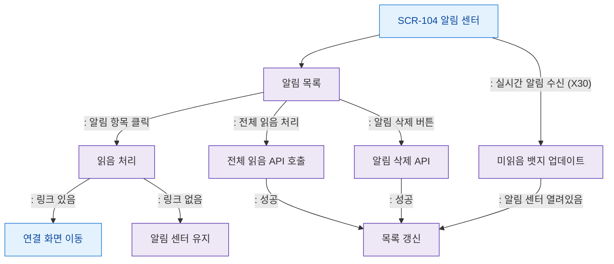

# F2 메인 인터랙션 플로우 — SCR-104 알림 센터

## 목적
알림 항목 클릭 → 읽음 처리 → 연결 화면 이동 흐름과 실시간 알림 수신 처리를 정의한다.

## 다이어그램

## TC 후보

| TC ID | 타입 | Given | When | Then | |-------|------|-------|------|------| | TC-104-F2-01 | positive | manager | 알림 항목 클릭 | 읽음 처리 + 연결 화면 이동 | | TC-104-F2-02 | positive | manager | 전체 읽음 처리 | 모든 알림 읽음 상태 | | TC-104-F2-03 | positive | manager | 알림 삭제 | 목록에서 제거 | | TC-104-F2-04 | positive | manager | 실시간 알림 수신 | 뱃지 + 목록 갱신 |
