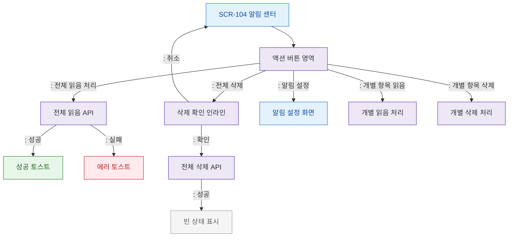

# F3 버튼/액션 플로우 — SCR-104 알림 센터

## 목적
알림 센터 상단 액션 버튼(전체 읽음, 전체 삭제, 설정)과 개별 항목 버튼 동작을 정의한다.

## 다이어그램

## TC 후보

| TC ID | 타입 | Given | When | Then | |-------|------|-------|------|------| | TC-104-F3-01 | positive | manager | 전체 읽음 처리 | 성공 토스트 표시 | | TC-104-F3-02 | positive | manager | 전체 삭제 확인 | 빈 상태 표시 | | TC-104-F3-03 | positive | manager | 전체 삭제 취소 | 목록 유지 | | TC-104-F3-04 | negative | manager | 전체 읽음 API 실패 | 에러 토스트 |
