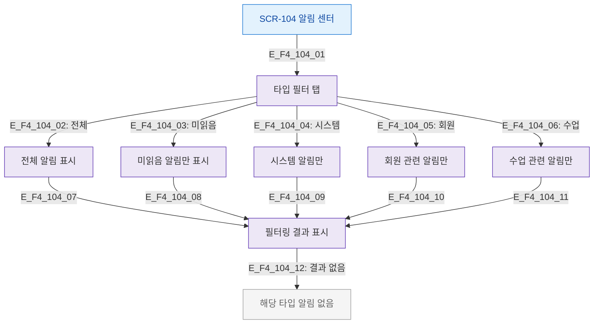

# F4 필터/검색 플로우 — SCR-104 알림 센터

## 목적
알림 타입 필터(전체/미읽음/시스템/회원/수업)와 기간 필터 흐름을 정의한다.

## 다이어그램

## TC 후보

| TC ID | 타입 | Given | When | Then |
|-------|------|-------|------|------|
| TC-104-F4-01 | positive | manager | '미읽음' 탭 클릭 | 미읽음 알림만 표시 |
| TC-104-F4-02 | positive | manager | '전체' 탭 클릭 | 전체 알림 표시 |
| TC-104-F4-03 | negative | manager | 해당 타입 알림 없음 | 빈 상태 메시지 |
