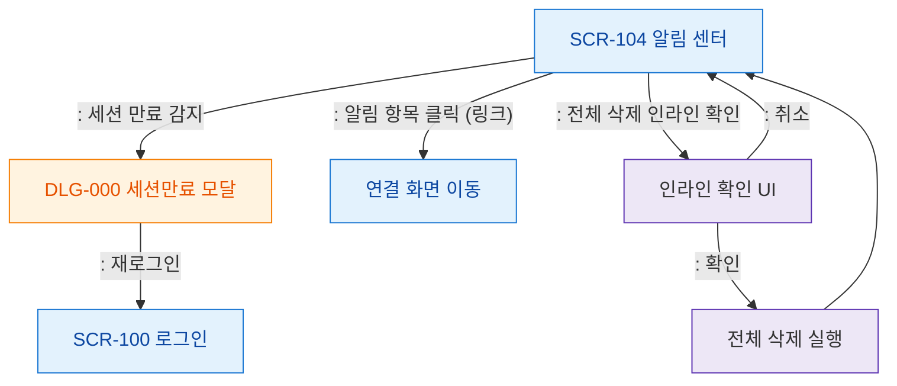

# F5 모달 트리거 트리 — SCR-104 알림 센터

## 목적
알림 센터에서 발생하는 모달/다이얼로그 트리거 경로를 정의한다.

## 다이어그램

## TC 후보

| TC ID | 타입 | Given | When | Then | |-------|------|-------|------|------| | TC-104-F5-01 | negative | manager | 세션 만료 감지 | DLG-000 세션만료 모달 | | TC-104-F5-02 | positive | manager | 알림 항목 링크 클릭 | 연결 화면 이동 | | TC-104-F5-03 | positive | manager | 전체 삭제 확인 | 삭제 실행 후 빈 상태 |
