# F6 상태별 화면 플로우 — SCR-104 알림 센터

## 목적
로딩/빈/에러/실시간수신 등 UI 상태별 분기를 정의한다.

## 다이어그램

```mermaid
flowchart TD
    ENTER([SCR-104 진입]) -->|E_F6_104_01| AUTH_CHECK{인증 상태}

    AUTH_CHECK -->|"E_F6_104_02: 미인증"| STATE_LOGIN[SCR-100 로그인 리다이렉트]
    AUTH_CHECK -->|"E_F6_104_03: 인증 완료"| LOADING{알림 목록 로딩}

    LOADING -->|"E_F6_104_04: 로딩 중"| STATE_LOADING[스켈레톤 로딩]
    LOADING -->|"E_F6_104_05: 로드 성공 + 알림 있음"| STATE_NORMAL[알림 목록 표시]
    LOADING -->|"E_F6_104_06: 로드 성공 + 알림 없음"| STATE_EMPTY[빈 상태\n새 알림이 없습니다]
    LOADING -->|"E_F6_104_07: API 오류"| STATE_ERROR[에러 상태\n재시도 버튼]

    STATE_NORMAL -->|"E_F6_104_08: 실시간 알림 수신"| REALTIME[미읽음 뱃지 업데이트\n목록 상단 추가]
    STATE_ERROR -->|"E_F6_104_09: 재시도"| LOADING

    classDef screen      fill:#E3F2FD,stroke:#1976D2,color:#0D47A1
    classDef error       fill:#FFEBEE,stroke:#C62828,color:#B71C1C
    classDef success     fill:#E8F5E9,stroke:#2E7D32,color:#1B5E20
    classDef system      fill:#EDE7F6,stroke:#5E35B2
    classDef rbacBlocked fill:#F5F5F5,stroke:#9E9E9E,color:#616161
    class STATE_NORMAL,STATE_LOADING screen
    class STATE_ERROR error
    class STATE_LOGIN success
    class STATE_EMPTY rbacBlocked
    class AUTH_CHECK,LOADING,REALTIME system
```

## TC 후보

| TC ID | 타입 | Given | When | Then |
|-------|------|-------|------|------|
| TC-104-F6-01 | positive | manager | 알림 센터 진입 | 스켈레톤 로딩 후 목록 표시 |
| TC-104-F6-02 | positive | manager, 알림 없음 | 로드 완료 | 빈 상태 메시지 표시 |
| TC-104-F6-03 | negative | manager | API 오류 | 에러 상태 + 재시도 버튼 |
| TC-104-F6-04 | positive | manager | 실시간 알림 수신 | 뱃지 + 목록 상단 추가 |
