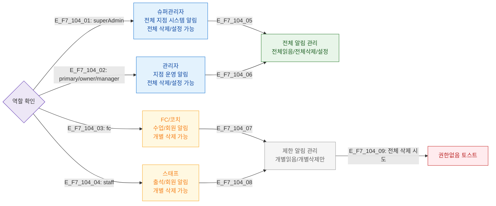

# F7 권한(RBAC) 분기 플로우 — SCR-104 알림 센터

## 목적
6개 역할별 알림 수신 범위와 관리 액션 가능 여부를 정의한다.

## 다이어그램

## TC 후보

| TC ID | 타입 | Given | When | Then |
|-------|------|-------|------|------|
| TC-104-F7-01 | positive | manager | 알림 센터 진입 | 전체 삭제/설정 버튼 표시 |
| TC-104-F7-02 | positive | staff | 알림 센터 진입 | 개별 삭제만 가능 |
| TC-104-F7-03 | negative | fc | 전체 삭제 버튼 클릭 | 권한없음 토스트 |
