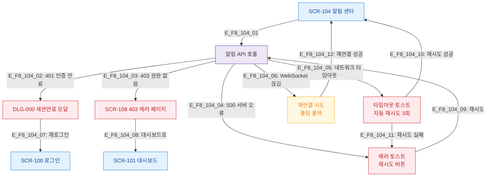

# F8 에러/예외/복구 플로우 — SCR-104 알림 센터

## 목적
알림 API 오류 분기와 복구 경로를 정의한다.

## 다이어그램

## TC 후보

| TC ID | 타입 | Given | When | Then |
|-------|------|-------|------|------|
| TC-104-F8-01 | negative | manager | 세션 만료 상태 | DLG-000 세션만료 모달 |
| TC-104-F8-02 | negative | manager | 알림 API 500 오류 | 에러 토스트 + 재시도 |
| TC-104-F8-03 | negative | manager | WebSocket 끊김 | 재연결 시도 + 폴링 폴백 |
