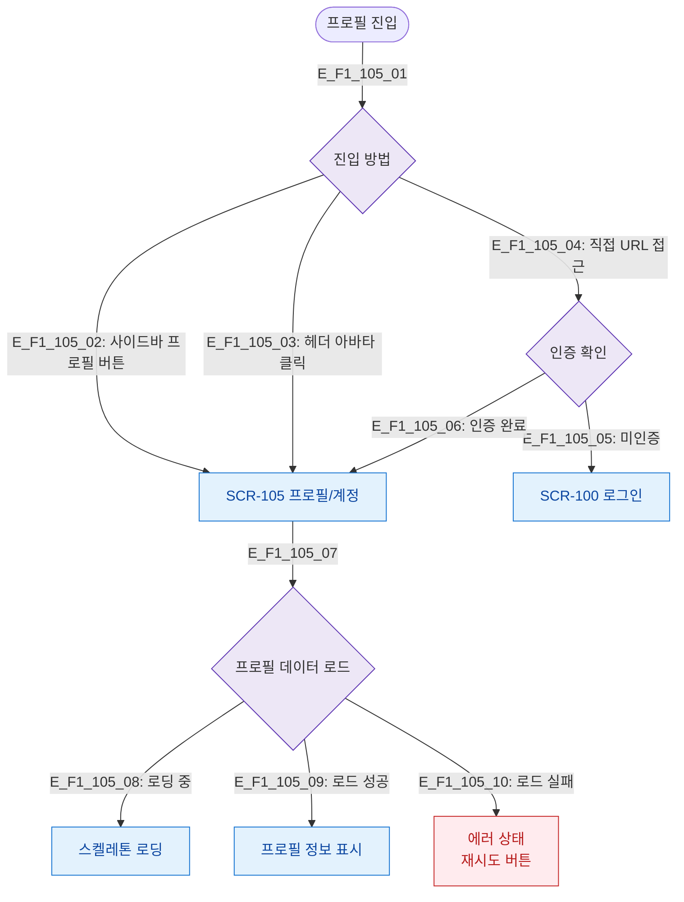

# F1 진입 플로우 — SCR-105 프로필/계정

## 목적
프로필/계정 화면 진입 경로와 초기 데이터 로드 순서를 정의한다.

## 다이어그램

## TC 후보

| TC ID | 타입 | Given | When | Then |
|-------|------|-------|------|------|
| TC-105-F1-01 | positive | manager | 사이드바 프로필 버튼 | SCR-105 진입 |
| TC-105-F1-02 | positive | manager | 진입 | 프로필 정보 로드 표시 |
| TC-105-F1-03 | negative | (미인증) | 직접 URL 접근 | SCR-100 리다이렉트 |
| TC-105-F1-04 | negative | manager | 데이터 로드 실패 | 에러 상태 + 재시도 |
