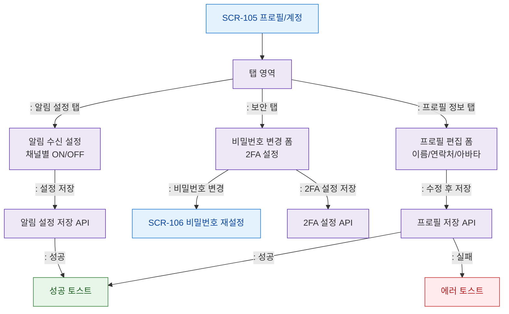

# F2 메인 인터랙션 플로우 — SCR-105 프로필/계정

## 목적
프로필 정보 수정, 비밀번호 변경, 알림 설정 탭 전환 흐름을 정의한다.

## 다이어그램

## TC 후보

| TC ID | 타입 | Given | When | Then | |-------|------|-------|------|------| | TC-105-F2-01 | positive | manager | 프로필 정보 수정 후 저장 | 성공 토스트 표시 | | TC-105-F2-02 | positive | manager | 보안 탭 비밀번호 변경 클릭 | SCR-106 이동 | | TC-105-F2-03 | positive | manager | 알림 설정 탭 저장 | 성공 토스트 표시 | | TC-105-F2-04 | negative | manager | 프로필 저장 실패 | 에러 토스트 표시 |
