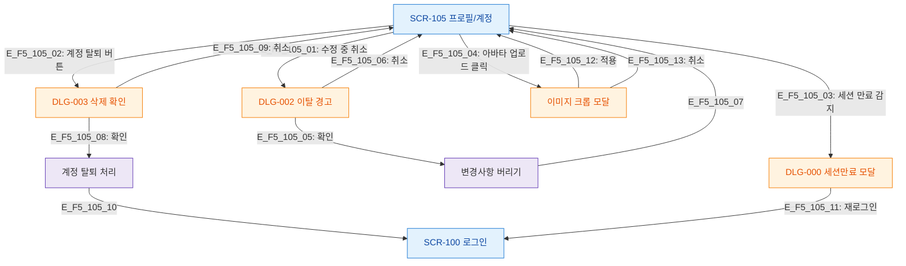

# F5 모달 트리거 트리 — SCR-105 프로필/계정

## 목적
프로필/계정 화면에서 발생하는 모달/다이얼로그 트리거 경로를 정의한다.

## 다이어그램

## TC 후보

| TC ID | 타입 | Given | When | Then |
|-------|------|-------|------|------|
| TC-105-F5-01 | positive | manager | 수정 중 취소 클릭 | DLG-002 이탈 경고 열림 |
| TC-105-F5-02 | positive | manager | 계정 탈퇴 버튼 클릭 | DLG-003 삭제 확인 열림 |
| TC-105-F5-03 | negative | manager | 세션 만료 감지 | DLG-000 세션만료 모달 |
| TC-105-F5-04 | positive | manager | 아바타 업로드 클릭 | 이미지 크롭 모달 열림 |
