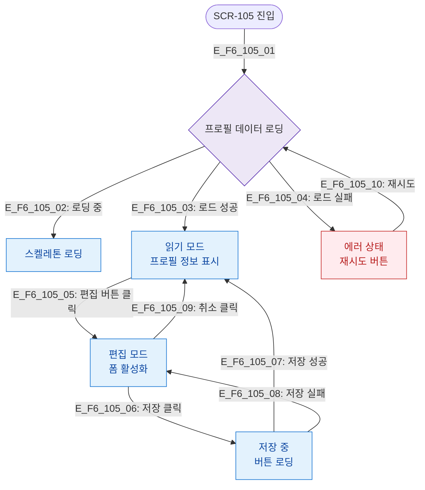

# F6 상태별 화면 플로우 — SCR-105 프로필/계정

## 목적
로딩/편집중/저장중/에러 등 UI 상태별 분기를 정의한다.

## 다이어그램

## TC 후보

| TC ID | 타입 | Given | When | Then |
|-------|------|-------|------|------|
| TC-105-F6-01 | positive | manager | 프로필 진입 | 읽기 모드 표시 |
| TC-105-F6-02 | positive | manager | 편집 버튼 클릭 | 편집 모드 전환 |
| TC-105-F6-03 | positive | manager | 저장 클릭 | 저장 중 버튼 로딩 |
| TC-105-F6-04 | negative | manager | 로드 실패 | 에러 상태 + 재시도 버튼 |
