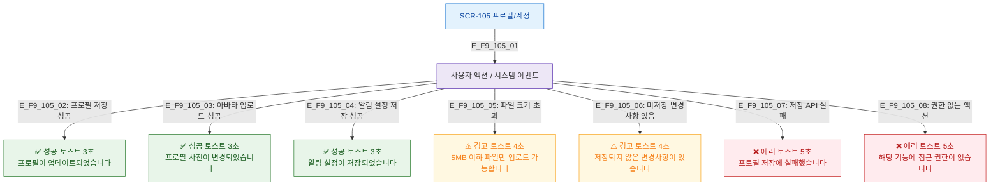

# F9 토스트/피드백 플로우 — SCR-105 프로필/계정

## 목적
프로필/계정 성공/경고/에러/정보 토스트 발생 조건과 메시지를 정의한다.

## 다이어그램

## TC 후보

| TC ID | 타입 | Given | When | Then |
|-------|------|-------|------|------|
| TC-105-F9-01 | positive | manager | 프로필 저장 성공 | 성공 토스트 3초 |
| TC-105-F9-02 | positive | manager | 아바타 업로드 성공 | 성공 토스트 3초 |
| TC-105-F9-03 | negative | manager | 파일 크기 초과 | 경고 토스트 4초 |
| TC-105-F9-04 | negative | manager | 저장 API 실패 | 에러 토스트 5초 |
