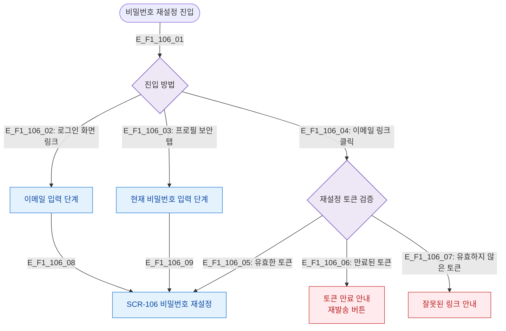

# F1 진입 플로우 — SCR-106 비밀번호 재설정

## 목적
비밀번호 재설정 화면 진입 경로(로그인 화면 링크 / 프로필 보안 탭)와 토큰 검증을 정의한다.

## 다이어그램

## TC 후보

| TC ID | 타입 | Given | When | Then |
|-------|------|-------|------|------|
| TC-106-F1-01 | positive | (비로그인) | 로그인 화면 링크 클릭 | 이메일 입력 단계 표시 |
| TC-106-F1-02 | positive | manager | 프로필 보안 탭 진입 | 현재 비밀번호 입력 단계 |
| TC-106-F1-03 | negative | (비로그인) | 만료된 토큰 링크 클릭 | 토큰 만료 안내 + 재발송 버튼 |
| TC-106-F1-04 | negative | (비로그인) | 잘못된 토큰 링크 | 잘못된 링크 안내 표시 |
