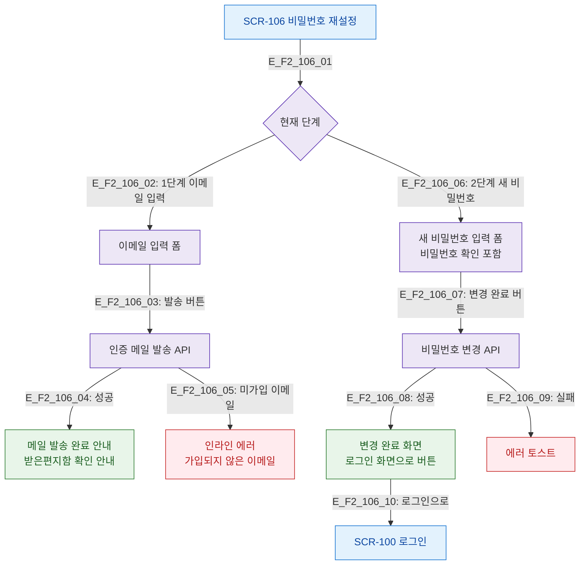

# F2 메인 인터랙션 플로우 — SCR-106 비밀번호 재설정

## 목적
이메일 입력 → 인증 메일 발송 → 새 비밀번호 입력 → 완료 단계별 흐름을 정의한다.

## 다이어그램

## TC 후보

| TC ID | 타입 | Given | When | Then |
|-------|------|-------|------|------|
| TC-106-F2-01 | positive | (비로그인) | 가입된 이메일 입력 후 발송 | 메일 발송 완료 안내 |
| TC-106-F2-02 | positive | (비로그인) | 새 비밀번호 입력 후 변경 | 완료 화면 표시 |
| TC-106-F2-03 | positive | (비로그인) | 완료 후 로그인으로 버튼 | SCR-100 이동 |
| TC-106-F2-04 | negative | (비로그인) | 미가입 이메일 입력 | 인라인 에러 메시지 |
