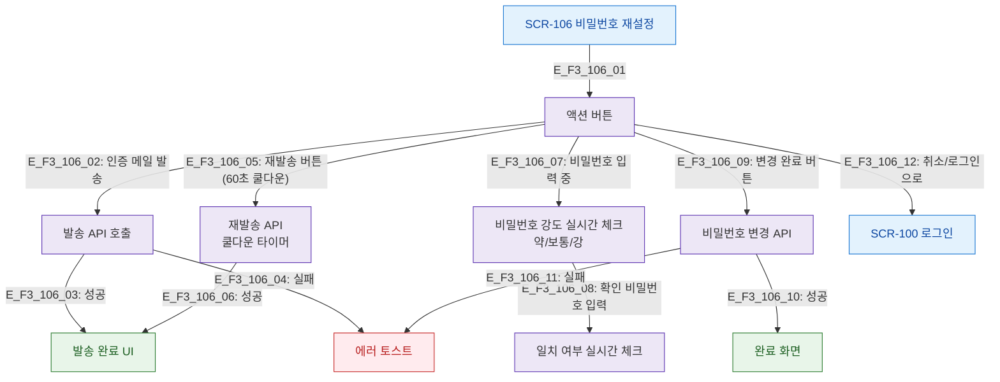

# F3 버튼/액션 플로우 — SCR-106 비밀번호 재설정

## 목적
각 단계별 버튼(발송/재발송/변경/취소) 동작과 비밀번호 강도 검사 흐름을 정의한다.

## 다이어그램

## TC 후보

| TC ID | 타입 | Given | When | Then |
|-------|------|-------|------|------|
| TC-106-F3-01 | positive | (비로그인) | 인증 메일 발송 | 발송 완료 UI 표시 |
| TC-106-F3-02 | positive | (비로그인) | 60초 후 재발송 | 재발송 성공 |
| TC-106-F3-03 | positive | (비로그인) | 비밀번호 입력 중 | 강도 표시 실시간 갱신 |
| TC-106-F3-04 | negative | (비로그인) | 비밀번호 불일치 | 불일치 인라인 에러 |
