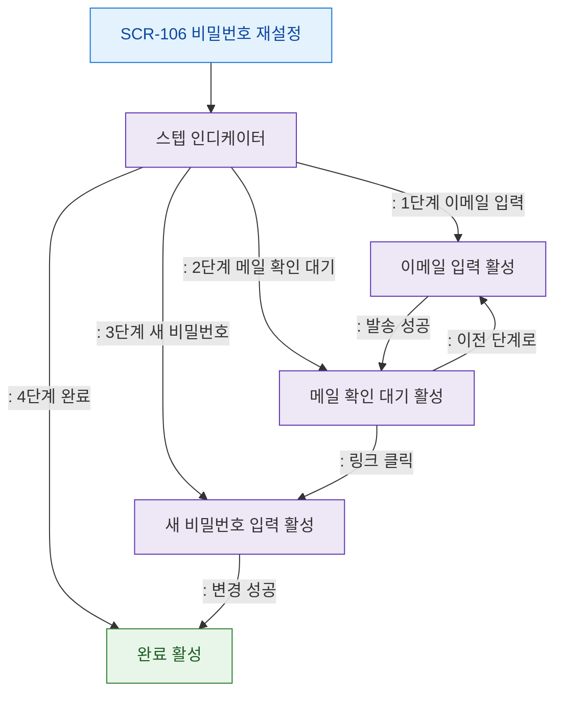

# F4 필터/검색 플로우 — SCR-106 비밀번호 재설정

## 목적
단계 진행 흐름(스텝 인디케이터)과 이전/다음 단계 전환을 정의한다.

## 다이어그램

## TC 후보

| TC ID | 타입 | Given | When | Then | |-------|------|-------|------|------| | TC-106-F4-01 | positive | (비로그인) | 이메일 발송 성공 | 스텝 2단계로 전진 | | TC-106-F4-02 | positive | (비로그인) | 2단계에서 이전 버튼 | 1단계로 복귀 | | TC-106-F4-03 | positive | (비로그인) | 비밀번호 변경 완료 | 4단계 완료 활성 |
